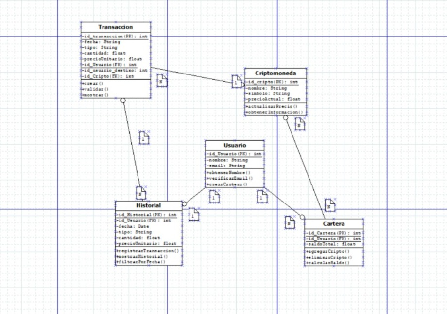

Proyecto CriptoWallet (Demo Spring Boot & JPA)

Este proyecto es una aplicación de demostración que implementa la lógica de negocio de una cartera de criptomonedas. Utiliza Spring Boot, Spring Data JPA y se conecta a una base de datos MySQL.

1. Conexión a la Base de Datos

La conexión a la base de datos se define en un único fichero application.properties ubicado en src/main/resources/.

Esta configuración está preparada para conectarse a una base de datos MySQL (en un contenedor Docker) llamada springbootdb con el usuario root y la contraseña password.

# URL de conexión corregida para MySQL 8+
spring.datasource.url=jdbc:mysql://localhost:3306/springbootdb?defaultAuthenticationPlugin=caching_sha2_password&serverTimezone=UTC

# Credenciales de la Base de Datos
spring.datasource.username=root
spring.datasource.password=password

# Configuración del Driver y Dialecto de Hibernate
spring.datasource.driver-class-name=com.mysql.cj.jdbc.Driver
spring.jpa.database-platform=org.hibernate.dialect.MySQLDialect

# Configuración de Hibernate
# 'update': Comprueba las tablas contra las entidades y las actualiza si es necesario. No borra datos.
spring.jpa.hibernate.ddl-auto=update
spring.jpa.show-sql=true

# Línea clave para cargar 'data.sql' al arrancar el main (no la hemos incluido) 
# Le dice a Spring que ejecute data.sql DESPUÉS de que Hibernate cree/actualice las tablas.
spring.jpa.defer-datasource-initialization=true

2. Estructura de Clases (Entidades)

El proyecto implementa el esquema Entidad-Relación proporcionado, mapeando 5 clases Java a tablas de la base de datos mediante anotaciones de JPA (@Entity).

Usuario.java: Es la entidad central.

@OneToOne con Historial: Un usuario tiene un único historial.

@OneToMany con Cartera: Un usuario puede poseer múltiples carteras.

@OneToMany con Transaccion: Un usuario está mapeado a transaccionesOrigen y transaccionesDestino.

Cartera.java: Representa la cartera de un usuario.

@ManyToOne con Usuario: Cada cartera pertenece a un solo usuario.

@ManyToMany con Criptomoneda: Una cartera puede contener muchas criptomonedas, y una criptomoneda puede estar en muchas carteras.

Criptomoneda.java: Define una criptomoneda (ej. Bitcoin).

@ManyToMany con Cartera: Mapeo inverso de la relación de Cartera.

@OneToMany con Transaccion: Una criptomoneda puede estar involucrada en múltiples transacciones.

Transaccion.java: Registra un movimiento de fondos.

@ManyToOne con Usuario (como usuarioOrigen).

@ManyToOne con Usuario (como usuarioDestino).

@ManyToOne con Criptomoneda.

Historial.java: Almacena un registro de actividad (en este esquema, está vinculado 1:1 con el usuario).

@OneToOne con Usuario.

(Nota: Todas las entidades incluyen métodos equals() y hashCode() basados en el Id para permitir una gestión correcta en colecciones Set y operaciones de borrado.)

3. Pruebas y Casos de Uso (Tests)

La lógica del proyecto se valida a través de tres ficheros de test especializados, cada uno con un propósito diferente:

UserDemoCasosUso.java: Valida cada función individual de la aplicación (un @Test por caso de uso) sobre una base de datos precargada con data.sql.

UserDemoCRUDTest.java: Valida el ciclo de vida completo (Crear, Leer, Actualizar, Borrar) y las cascadas desde una base de datos vacía.

UserDemoGenericTests.java: Valida un flujo de negocio complejo que involucra a múltiples entidades, también sobre los datos de data.sql.

Todos los tests están configurados para usar una configuración de pruebas (src/test/resources/application.properties) que utiliza ddl-auto=create-drop, y cargan data.sql (excepto el test CRUD), asegurando que cada prueba se ejecute de forma aislada y limpia gracias a @DirtiesContext.

A continuación, se detallan los casos de uso empleados en el fichero UserDemoCasosUso.java:

3.1. Casos de Uso: USUARIO (Tests 1-5)

Test 1: Verificar Carga Inicial: Comprueba que data.sql ha cargado los 3 usuarios, 3 criptos, 4 carteras, 3 historiales y 3 transacciones.

Test 2: Crear Usuario y Historial: Demuestra que CascadeType.ALL funciona al crear un Usuario nuevo ("David") y su Historial se guarda automáticamente en la misma operación.

Test 3: Encontrar por Email/Nombre: Valida las consultas simples del repositorio (findByEmail, findByNombreStartingWith).

Test 4: Query Múltiples Carteras: Valida la consulta @Query findUsuariosConMultiplesCarteras(), verificando que solo encuentra a 'Ana' (que es la única con 2 carteras en data.sql).

Test 5: Query por Cripto: Valida la consulta @Query findUsuariosByCriptoSimbolo(), comprobando que encuentra a los usuarios correctos que poseen "BTC".

3.2. Casos de Uso: CARTERA (Tests 6-10)

Test 6: Crear Cartera: Demuestra que se puede crear una nueva cartera (Cartera ID 5) y asignarla a un usuario existente ('Luis').

Test 7: Encontrar Carteras por Usuario: Valida carteraRepository.findByUsuario(ana), confirmando que devuelve 2 carteras (la ID 1 y la ID 4).

Test 8: Query Calcular Balance Total: Valida getBalanceTotalPorUsuario(ana), confirmando que suma los balances de las carteras de Ana (1500 + 100 = 1600.0).

Test 9: Añadir Cripto (N:M): Simula que 'Luis' compra 'BTC'. El test añade 'BTC' al Set de la Cartera 2 y guarda (carteraRepository.save()). JPA inserta la fila en la tabla cartera_cripto.

Test 10: Quitar Cripto (N:M): Simula que 'Ana' vende 'ETH'. El test quita 'ETH' del Set de la Cartera 1 (usando .remove(), que funciona gracias a equals/hashCode) y guarda. JPA elimina la fila de cartera_cripto.

3.3. Casos de Uso: CRIPTOMONEDA (Tests 11-15)

Test 11 y 12: CRUD Básico: Prueba save() creando "Dogecoin" y findBySimbolo() encontrando "BTC".

Test 13: Query Criptos por Cartera: Valida findCriptomonedasByCarterasId(3L), confirmando que encuentra "BTC" y "SOL" (las criptos de la Cartera 3 de Carla).

Test 14: Borrado Fallido (Relaciones): Demuestra que no se puede borrar 'BTC' (criptomonedaRepository.delete(btc)) porque está siendo referenciada por carteras. El test confirma que se lanza una DataIntegrityViolationException.

Test 15: Borrado Exitoso: Demuestra el borrado seguro.

Crea "Cardano (ADA)".

La asigna a la Cartera 2 de Luis y guarda.

La quita de la Cartera 2 de Luis y guarda (rompiendo la relación N:M).

Ahora, criptomonedaRepository.delete(ada) funciona porque no hay referencias.

3.4. Casos de Uso: TRANSACCION (Tests 16-19)

Test 16: Crear Transacción: Crea una nueva transacción de 'Ana' a 'Luis' y verifica que el contador total de transacciones aumenta.

Test 17: Query Transacciones por Usuario: Valida findAllTransaccionesByUsuario(luis), confirmando que encuentra las 2 transacciones donde Luis participa (la 1 como destino, la 3 como origen).

Test 18: Query por Rango de Fechas: Valida findTransaccionesEnRangoDeFechas(), pidiendo transacciones entre dos fechas y confirmando que devuelve 2.

Test 19: Query Transacciones Internas: Valida findTransaccionesInternas() creando una transacción de 'Ana' para 'Ana' y verificando que la consulta la encuentra.

3.5. Casos de Uso: HISTORIAL (Tests 20-22)

Test 20: Encontrar por Usuario (1:1): Valida historialRepository.findByUsuario(carla), comprobando que devuelve el historial correcto.

Test 21: Actualizar Historial: Obtiene el historial de 'Ana', le añade texto (.setDetalle(...)) y guarda. Se comprueba que el texto se ha actualizado.

Test 22: Query Usuarios Activos: Valida countHistorialesConTransacciones(), confirmando que los 3 usuarios de data.sql han participado en transacciones.

3.6. Caso de Uso: BORRADO EN CASCADA (Test 23)

Este es el test más importante de la lógica de persistencia.

Objetivo: Eliminar al usuario 'Luis' (ID 2) y verificar que todo lo que le pertenece se borra automáticamente.

Lógica en Java:

Se verifican los datos de 'Luis' (ID 2): su Historial (ID 2), su Cartera (ID 2), su Transaccion enviada (ID 3) y su Transaccion recibida (ID 1).

Se ejecuta usuarioRepository.deleteById(luisId);.

Qué hace JPA (SQL):
Gracias a las reglas CascadeType.ALL y orphanRemoval=true definidas en la entidad Usuario.java:

JPA detecta que luis (ID 2) va a ser borrado.

Cascada 1:1 (Historial): Borra el Historial de Luis (ID 2).

Cascada 1:N (Carteras): Borra la Cartera de Luis (ID 2).

Cascada 1:N (Transacciones Origen): Borra la Transaccion ID 3.

Cascada 1:N (Transacciones Destino): Borra la Transaccion ID 1.

Final: JPA borra a luis de la tabla usuarios.

Comprobaciones del Test:

Se verifica que Luis, su Cartera (ID 2), su Historial (ID 2), la TX 3 y la TX 1 están borradas (isEmpty()).

Se verifica que los datos de otros usuarios (como la Cartera ID 3 de Carla y la TX 2 de Ana) siguen existiendo (isPresent()).

Continuamos con los detalles del siguiente test en este caso:

3.7. Caso de Uso: Ciclo de Vida CRUD (de UserDemoCRUDTest.java)

Este test prueba la creación en cascada desde una base de datos limpia (no usa data.sql).

Objetivo: Crear un nuevo usuario ("David") con su historial y carteras, y luego borrarlo.

Lógica en Java (CREATE):

Se crea un Usuario ("David").

Se crea un Historial y se enlaza (david.setHistorial(hDavid)).

Se crea una Cartera y se enlaza (david.addCartera(cDavid1)).

Se llama una sola vez a usuarioRepository.save(david).

Qué hace JPA (SQL):
Gracias a CascadeType.ALL en Usuario, JPA ejecuta múltiples sentencias INSERT: una para usuarios, una para historiales y otra para carteras, gestionando las claves foráneas automáticamente.

Lógica en Java (DELETE):

Al final del test, se borra a "David" (usuarioRepository.delete(davidLeido)).

Comprobaciones del Test:

Se verifica que "David" y todas sus entidades (historial, cartera, transacciones) se han borrado, pero los usuarios originales de data.sql (Ana, Luis, Carla) siguen intactos (ya que este test se ejecuta sobre los datos de data.sql).

El último test es el generico que simula un flujo de negocio complejo:

3.8. Caso de Uso: Lógica de Negocio (de UserDemoGenericTests.java)

Este test simula un flujo de negocio complejo sobre los datos de data.sql.

Objetivo: 'Luis' crea una nueva cartera, la financia con BTC y realiza una transferencia a 'Ana'.

Lógica en Java:

READ: Se obtienen 'Luis', 'Ana' y 'BTC' de los repositorios.

CREATE: Se crea una Cartera y se asocia a 'Luis' (luis.addCartera(carteraAhorroLuis)). Se guarda la cartera.

UPDATE (N:M): Se añade 'BTC' a la nueva cartera (carteraAhorroLuis.addCriptomoneda(btc)). Se guarda la cartera.

CREATE: Se crea una Transaccion de 'Luis' a 'Ana' (transaccionRepository.save(nuevaTx)).

UPDATE: Se actualiza el detalle de los Historial de 'Luis' y 'Ana' (historialRepository.save(...)).

Comprobaciones del Test:

Se verifica que Luis ahora tiene 2 carteras, que se ha creado 1 nueva transacción, y que los historiales de ambos usuarios contienen el nuevo detalle.

4. Cómo Ejecutar el Proyecto

Asegúrese de tener su contenedor Docker con MySQL en ejecución.

Ejecutar la Aplicación Principal

Desde la terminal, en la raíz del proyecto:

# En Windows
.\mvnw.cmd spring-boot:run

La aplicación arrancará, cargará los datos de data.sql (gracias a defer-datasource-initialization=true) y se quedará "escuchando" en http://localhost:8080.

Ejecutar los Tests

Desde la terminal:

# En Windows
.\mvnw.cmd test -Dtest=*UserDemoCasosUso

Esto ejecutará el test de UserDemoCasosUso.java contra su base de datos.

El diagrama de Entidad-Relacion se adjunta en el proyecto.

